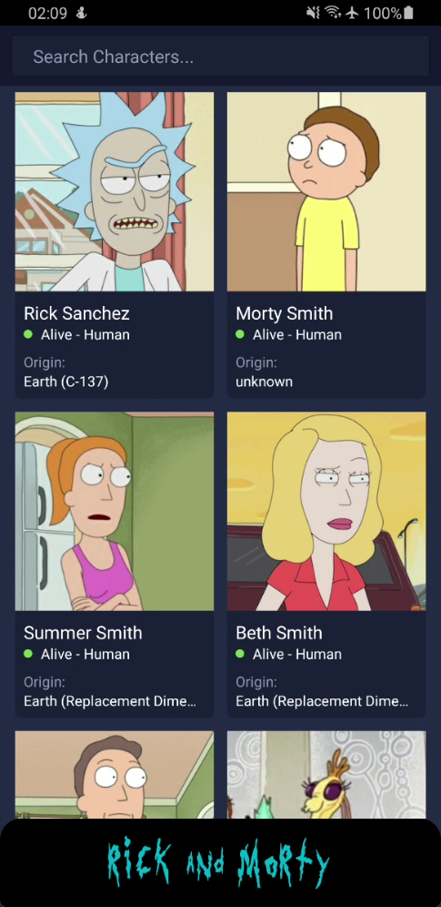
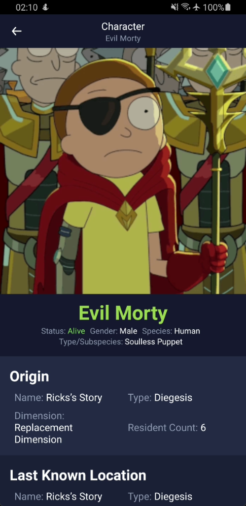

# Rick and Morty React Native App

This is a hybrid mobile app which displays information about all the characters that appear in the show 'Rick and Morty'.

**Framework:** React Native (React Native CLI)

**Version:** 0.68.0

## Installation Steps

Setup the React Native CLI Development environment for your machine if you haven't already: [Follow this guide](https://reactnative.dev/docs/environment-setup)

Now, follow the below steps in order to run the app:

1. Clone this repo using Sourcetree or using git.

2. `yarn install` to install node packages

3. `cd ios && pod install && cd ../` to generate ios pod files (skip if building for android only on windows)

4. `npx react-native start` to start the metro server (keep running in terminal)

5. `react-native run-android` (in separate/new terminal) to run app in android simulator. Before running android please open the android simulator to run the app

6. `react-native run-ios` (in separate/new terminal) to run the app in ios simulator

## Details

- UI Library Used: [React Native UI Kitten](https://akveo.github.io/react-native-ui-kitten/)

- API Used: [Rick and Morty API](https://rickandmortyapi.com/). A custom Wrapper/Sdk has been created for the API ([See File Here](./app/utils/api/rnmApi.js)).

- Screens:

  1. **Home Screen**: _Displays all known characters from Rick and Morty in an Infinite Scroll Fashion. Also contains a search bar to filter characters by their name._

     

  2. **Character Screen**: _Displays detailed information about a selected character. Character Information, their where abouts, origin, and episode appearances are displayed here._

     
